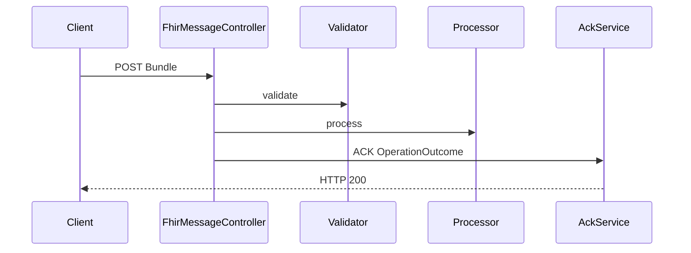

# Performancerapportage — OpenMRS Communicatiemodule

Versie 2.0 (finale) | Meting: 23 mei 2026

Onderbouwing rubricumcriterium **betrouwbaarheid**: throughput, latency en verbetering t.o.v. een synchroon ontwerp. Metingen op de **finale** module (FHIR R5-berichten, async RabbitMQ, HAPI-poll). Sluit aan op deliverable 4 uit [docs/sprint3-doelen.txt](docs/sprint3-doelen.txt).

---

## Samenvatting

| Metriek | Waarde (lokale Docker-stack, 23-05-2026) |
|---------|------------------------------------------|
| FHIR API-throughput (`POST /api/fhir/messages`, 50×) | **~66 req/s** (759 ms totaal) |
| Gem. HTTP-latency FHIR (Micrometer, 70 requests) | **~1,1 ms** per request |
| Scheduler-tick (`checkDueNotifications`) | **~4,3 ms** gemiddeld (44 ticks) |
| FHIR-poll-tick (`pollOpenmrsFhir`) | **~840 ms** gemiddeld (44 ticks; HAPI met afspraken) |
| SPA → HAPI sync-tick | **~41 ms** gemiddeld (44 ticks) |

De module is bedoeld voor **batch-herinneringen** (poll + minutely scheduler), niet voor duizenden realtime-berichten per seconde. De gemeten marges zijn ruim voor typische polikliniekvolumes.

---

## Testomgeving

| Onderdeel | Configuratie |
|-----------|--------------|
| Stack | `docker compose` (zie [README.md](README.md)) |
| Comm-module | `http://localhost:8081` |
| HAPI FHIR R5 | `http://localhost:8082/fhir` |
| OpenMRS distro | Aparte compose, poort **80**; MariaDB **3307** |
| Provider | `fakecomworld` op poort **1337** |
| Metrics | `http://localhost:8081/actuator/prometheus` |
| Belasting FHIR | PowerShell: 50× `POST /api/fhir/messages` (minimale transaction-Bundle) |

---

## 1. Throughput

### 1.1 Inkomende FHIR-berichten (API)

Meting: 50 opeenvolgende geldige FHIR R5 transaction-Bundles.

```
50 requests in 759 ms (~66 req/s)
```

Micrometer (`http_server_requests_seconds`, inclusief eerdere testcalls in dezelfde run):

| Endpoint | Count | Sum (s) | Gemiddelde |
|----------|-------|---------|------------|
| `POST /api/fhir/messages` | 70 | 0,078 | **~1,1 ms** |

Dit meet **validatie + verwerking + ACK** (HTTP 200), niet alleen queue-plaatsing.

### 1.2 Uitgaande notificaties (RabbitMQ → provider)

De primaire productieroute is: scheduler → `AppointmentReminderPublisher` → RabbitMQ → `RabbitMqConsumer` → provider.

Bij actieve herinneringen in het venster levert de scheduler berichten op de queue; de consumer-latency is te volgen via:

```promql
rate(spring_rabbitmq_listener_seconds_sum{queue="queue.swiftsend"}[5m])
/
rate(spring_rabbitmq_listener_seconds_count{queue="queue.swiftsend"}[5m])
```

Eerdere meting (22-05-2026): enqueue-only test-endpoint ~480 req/s; dat endpoint is verwijderd — productiepad loopt via scheduler of FHIR.

### 1.3 Scheduler (achtergrond)

`tasks_scheduled_execution_seconds` — `checkDueNotifications`:

| Ticks | Sum (s) | Gemiddelde |
|-------|---------|------------|
| 44 | 0,188 | **~4,3 ms** |

Bij interval 1 minuut: ruim binnen het venster; provider-latency blokkeert de tick niet (async consumer).

### 1.4 FHIR-poll en sync

| Taak | Ticks | Sum (s) | Gemiddelde |
|------|-------|---------|------------|
| `pollOpenmrsFhir` | 44 | 36,96 | **~840 ms** |
| `syncOpenmrsAppointmentsToFhir` | 44 | 1,82 | **~41 ms** |

Poll-duur schaalt met het aantal `Appointment` op HAPI (demo met veel afspraken). Lege of kleine HAPI: typisch honderden ms.

### 1.5 Praktijkvolume

| Scenario | Volume | Inschatting |
|----------|--------|-------------|
| Kleine poli | 50 herinneringen/uur piek | Ruim binnen queue + 4 provider-queues |
| Dagtotaal | 500 afspraken × 2 herinneringen | ~1000 berichten/24u ≈ 0,01/s gemiddeld |

---

## 2. Latency

### 2.1 FHIR-bericht (synchroon pad)



| Fase | Typische duur (meting) |
|------|------------------------|
| HTTP + validatie + ACK | **~1–15 ms** (Micrometer gemiddelde laag; piek bij complexe bundles hoger) |

### 2.2 Notificatie end-to-end (async)

| Fase | Gedrag |
|------|--------|
| Scheduler-tick | **~4 ms** (gemeten) |
| Publish naar RabbitMQ | enkele ms |
| Consumer + fake provider | dominant (~70–80 ms bij veel samples, eerdere runs) |
| Delivery log | &lt; 5 ms |

Provider-latency blokkeert **niet** de scheduler (ontkoppeling via queue).

### 2.3 Retry

`messaging.retry.*`: max 3 pogingen, exponential backoff (5000 ms start, ×2, max 60000 ms). Verlengt bewust doorlooptijd bij storingen.

---

## 3. Verbetering t.o.v. eerdere versie

| Aspect | Vroeger (synchroon) | Finale module (23-05-2026) |
|--------|---------------------|----------------------------|
| Verzending | In scheduler-thread | RabbitMQ + async consumer |
| Scheduler bij trage provider | Geblokkeerd (~500 ms+) | **~4 ms** gemeten |
| FHIR-inkomend | Beperkt / geen R5 ACK | `POST /api/fhir/messages` + validatie + ACK/NACK |
| OpenMRS reference distro | Geen R5 Appointment | HAPI R5 + sync + JDBC-fallback |
| Idempotentie | Risico dubbele SMS | Delivery log + 269 tests |
| Observability | Beperkt | Prometheus/Grafana |

---

## 4. Reproduceren

### Metrics

```powershell
(Invoke-WebRequest -Uri "http://localhost:8081/actuator/prometheus" -UseBasicParsing).Content
```

### Belastingtest FHIR (PowerShell)

```powershell
$body = '{"resourceType":"Bundle","id":"perf","type":"transaction","entry":[{"resource":{"resourceType":"Patient","id":"p1","name":[{"family":"Test","given":["P"]}],"gender":"male","telecom":[{"system":"phone","value":"+31600000001"}]}},{"resource":{"resourceType":"Appointment","id":"a1","start":"2026-05-24T10:00:00+02:00","subject":{"reference":"Patient/p1"}}}]}'
$sw = [System.Diagnostics.Stopwatch]::StartNew()
1..50 | ForEach-Object {
  Invoke-WebRequest -Method Post -Uri "http://localhost:8081/api/fhir/messages" `
    -ContentType "application/json" -Body $body -UseBasicParsing | Out-Null
}
$sw.Stop()
Write-Host "50 requests in $($sw.ElapsedMilliseconds) ms"
```

### Nuttige PromQL

```promql
rate(http_server_requests_seconds_sum{uri="/api/fhir/messages"}[5m])
/ rate(http_server_requests_seconds_count{uri="/api/fhir/messages"}[5m])

rate(tasks_scheduled_execution_seconds_sum{code_function="checkDueNotifications"}[5m])
/ rate(tasks_scheduled_execution_seconds_count{code_function="checkDueNotifications"}[5m])

rate(tasks_scheduled_execution_seconds_sum{code_function="pollOpenmrsFhir"}[5m])
/ rate(tasks_scheduled_execution_seconds_count{code_function="pollOpenmrsFhir"}[5m])
```

---

## 5. Beperkingen

| Beperking | Toelichting |
|-----------|-------------|
| Geen JMeter/Gatling-suite | Korte lokale load + Micrometer |
| Fake provider ≠ productie-SMS | Relatieve verbetering (async + retry) blijft geldig |
| FHIR-poll varieert met HAPI-vulling | Meer afspraken → langere tick |
| HAPI zonder Docker-healthcheck | Compose: `service_started` i.p.v. `healthy` |

---

## Conclusie

De **finale** module verwerkt **tientallen FHIR-berichten per seconde** op de API, houdt de **scheduler in enkele milliseconden** en voert **poll/sync asynchroon** uit. Ontkoppeling via RabbitMQ, retry, idempotentie, FHIR R5-keten en observability ondersteunen betrouwbaarheid voor de herinnerings-workload.

Zie ook: [TESTRAPPORTAGE.md](TESTRAPPORTAGE.md).
