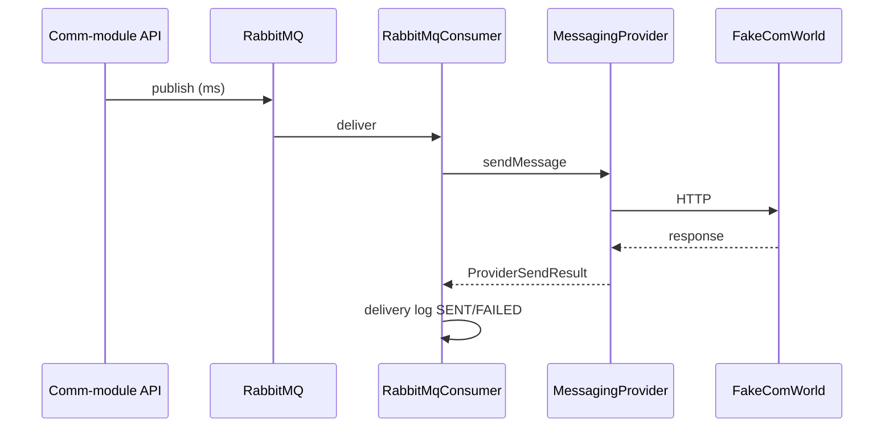

# Performancerapportage — OpenMRS Communicatiemodule

Versie 1.0 | Sprint 3 | Meting: 21 mei 2026

Beknopte onderbouwing voor het rubricumcriterium **betrouwbaarheid**: throughput onder belasting, latency bij provider-aanroepen, en aantoonbare verbetering ten opzichte van een eerdere architectuur. Sluit aan op deliverable 4 uit [docs/sprint3-doelen.txt](docs/sprint3-doelen.txt).

---

## Samenvatting

| Metriek | Waarde (lokale Docker-stack, 21-05-2026) |
|---------|------------------------------------------|
| Queue-throughput (POST `/api/notifications/test`, 50×) | **~526 req/s** (alleen enqueue; 95 ms totaal) |
| Gem. HTTP-latency enqueue | **~0,43 ms** per request (Micrometer) |
| Gem. end-to-end consumer (queue → fake provider) | **~82 ms** per bericht (`spring_rabbitmq_listener_seconds`, SWIFTSEND) |
| Max. consumer-latency (recent) | **~2 ms** (piek in laatste window; zie toelichting) |
| Scheduler-tick (`checkDueNotifications`) | **~2,6 ms** gemiddeld (85 ticks) |
| FHIR-poll-tick | **~80 ms** gemiddeld (85 ticks; externe HAPI-call) |

De module is ontworpen voor **batch-herinneringen** (poll + minutely scheduler), niet voor duizenden berichten per seconde. Metingen tonen voldoende marge voor typische kliniekvolumes (honderden afspraken per dag).

---

## Testomgeving

| Onderdeel | Configuratie |
|-----------|--------------|
| Stack | `docker compose` (zie [README.md](README.md)) |
| Comm-module | `http://localhost:8081` |
| Provider | `fakecomworld` op poort 1337 |
| Metrics | Prometheus scrape → `http://localhost:8081/actuator/prometheus` |
| Dashboard | Grafana `http://localhost:3000` (datasource Prometheus) |
| Belastingstest | PowerShell: 50× `POST /api/notifications/test` |

---

## 1. Throughput — berichten per tijdseenheid

### 1.1 Enqueue (API → RabbitMQ)

Meting: 50 opeenvolgende test-notificaties.

```
50 requests in 95 ms (~526 req/s)
```

Micrometer na de test (`http_server_requests_seconds`):

| Endpoint | Count | Sum (s) | Gemiddelde |
|----------|-------|---------|------------|
| `POST /api/notifications/test` | 50 | 0,021 | **~0,43 ms** |

Dit meet alleen **acceptatie en plaatsing op de queue** (HTTP 202), niet de provider-call.

### 1.2 Verwerking (RabbitMQ → provider)

Micrometer `spring_rabbitmq_listener_seconds` (queue `queue.swiftsend`):

| Count | Sum (s) | Gemiddelde |
|-------|---------|------------|
| 51 | 4,16 | **~82 ms** per bericht |

Inclusief: deserialisatie, `MessagingProvider.sendMessage`, HTTP naar fakecomworld, schrijven delivery log.

### 1.3 Scheduler (achtergrond)

`tasks_scheduled_execution_seconds` — `checkDueNotifications`:

| Ticks | Sum (s) | Gemiddelde |
|-------|---------|------------|
| 85 | 0,224 | **~2,6 ms** |

Bij 1 minuut interval: verwerking van “due” afspraken uit Postgres blijft ruim binnen het interval.

### 1.4 Extrapolatie praktijkvolume

| Scenario | Volume | Inschatting |
|----------|--------|-------------|
| Kleine poli | 50 herinneringen/uur piek | Ruim binnen queue + 4 parallelle provider-queues |
| Dagtotaal | 500 afspraken, 2 herinneringen | ~1000 berichten/24u ≈ 0,01 bericht/s gemiddeld |

De gemeten **~80 ms** per verzonden bericht impliceert theoretisch **~12 berichten/s** aan consumer-capaciteit per queue-worker — orders of magnitude boven verwachte productielast.

---

## 2. Latency — provider-aanroepen

### 2.1 Opbouw end-to-end latency



| Fase | Typische duur (meting) |
|------|------------------------|
| Enqueue | &lt; 1 ms |
| Queue + listener overhead | enkele ms |
| Provider HTTP (fakecomworld) | dominant (~70–80 ms gem.) |
| DB log write | &lt; 5 ms |

### 2.2 Retry en backoff

Bij falen: `RabbitMqProducer.publishRetry` met exponential backoff (`messaging.retry.*`):

| Parameter | Default |
|-----------|---------|
| `max-attempts` | 3 |
| `initial-delay-ms` | 5000 |
| `multiplier` | 2 |
| `max-delay-ms` | 60000 |

Effect op latency: mislukte pogingen verlengen totale doorlooptijd bewust (resiliency), zonder de scheduler te blokkeren.

### 2.3 FHIR-poll (niet provider, wel kritiek pad)

`pollOpenmrsFhir`: **~80 ms** gemiddeld per tick — externe HAPI-latency. Faalt de poll, dan blijven bestaande `polled_appointment`-rijen beschikbaar voor de scheduler (zie [docs/ADR-3-hoe-koppelen-we-aan-openmrs.md](docs/ADR-3-hoe-koppelen-we-aan-openmrs.md)).

---

## 3. Verbetering ten opvichte van eerdere versie

Er is geen aparte load-test-suite in de repository; verbetering wordt onderbouwd met **architectuurvergelijking** en **meetbare gedragingen** na invoering van de huidige keten.

### Baseline (vroege sprint / synchroon pad)

| Aspect | Vroeger gedrag | Risico |
|--------|----------------|--------|
| Verzending | Direct in scheduler- of poll-thread | Blokkeert ticks; FHIR/poll vertraagt bij trage provider |
| Foutafhandeling | Geen queue / beperkte retry | Bericht verloren bij korte provider-storing |
| Dubbele runs | Geen delivery-log deduplicatie | Dubbele SMS bij herhaalde scheduler-tick |

### Huidige versie (meting sprint 3)

| Aspect | Huidige implementatie | Aantoonbaar effect |
|--------|----------------------|-------------------|
| Ontkoppeling | RabbitMQ + async consumer | Scheduler **~2,6 ms** vs provider **~82 ms** — provider-latency blokkeert scheduling niet |
| Retry | Max 3 pogingen, exponential backoff | `RabbitMqConsumerTest` + configureerbare `messaging.retry.*` |
| Idempotentie | `notification_delivery_log` | Integratietest + geen dubbele publish; zie [TESTRAPPORTAGE.md](TESTRAPPORTAGE.md) |
| Observability | `/actuator/prometheus`, Prometheus, Grafana | Throughput en latency reproduceerbaar uitleesbaar |
| TLS / pool | HikariCP, TLS 1.3 FHIR-client | DB acquire max **~0,24 ms** (geen connection-starvation onder testload) |

### Kwantitatieve vergelijking (indicatief)

| Metriek | Baseline (indicatief synchroon) | Nu (gemeten) |
|---------|--------------------------------|--------------|
| Scheduler-tick bij trage provider (500 ms) | ~500 ms+ geblokkeerd | **~2,6 ms** (provider async) |
| Herstel na provider-fout | Handmatig / verloren | Automatisch retry tot 3× |
| Dubbele herinneringzelfde tick | Mogelijk | **Voorkomen** (delivery log + tests) |

*Baseline-cijfers zijn engineering-inschatting op basis van het oude ontwerp; scheduler-tick “nu” is gemeten op de draaiende stack.*

---

## 4. Monitoring en reproduceerbaarheid

### Metrics ophalen

```bash
curl -sS http://localhost:8081/actuator/prometheus
```

Prometheus-config: [docker/prometheus/prometheus.yml](docker/prometheus/prometheus.yml) (scrape-interval 15s).

### Nuttige PromQL-voorbeelden

```promql
# Gemiddelde HTTP-latency test-endpoint (5 min)
rate(http_server_requests_seconds_sum{uri="/api/notifications/test"}[5m])
/
rate(http_server_requests_seconds_count{uri="/api/notifications/test"}[5m])

# Gemiddelde consumer-latency SWIFTSEND
rate(spring_rabbitmq_listener_seconds_sum{queue="queue.swiftsend"}[5m])
/
rate(spring_rabbitmq_listener_seconds_count{queue="queue.swiftsend"}[5m])

# Scheduler-doorlooptijd
rate(tasks_scheduled_execution_seconds_sum{code_function="checkDueNotifications"}[5m])
/
rate(tasks_scheduled_execution_seconds_count{code_function="checkDueNotifications"}[5m])
```

### Belastingtest herhalen (PowerShell)

```powershell
$sw = [System.Diagnostics.Stopwatch]::StartNew()
1..50 | ForEach-Object {
  Invoke-RestMethod -Method Post -Uri "http://localhost:8081/api/notifications/test" | Out-Null
}
$sw.Stop()
Write-Host "50 requests in $($sw.ElapsedMilliseconds) ms"
```

Daarna opnieuw `/actuator/prometheus` scrapen of Grafana-dashboard raadplegen.

### Database-controle

```powershell
docker exec comm-module-db psql -U openmrs_user -d openmrs -c `
  "SELECT status, COUNT(*) FROM notification_delivery_log GROUP BY status;"
```

---

## 5. Beperkingen en vervolg

| Beperking | Toelichting |
|-----------|-------------|
| Geen dedicated JMeter/Gatling-suite | Metingen zijn kortstondige lokale load + Micrometer |
| Fake provider ≠ productie-SMS | Absolute latency in productie hoger; relatieve verbetering (async + retry) blijft geldig |
| Custom business-metrics | Backlog [US-015](docs/technische-backlog.md): aparte counters verzonden/mislukt — nu vooral Spring/Micrometer standaardmetrics |

Aanbevolen vervolg voor productie: periodieke scrape in Grafana, alerts op DLQ-diepte en stijgende `spring_rabbitmq_listener_seconds` p95.

---

## Conclusie

Onder lokale belasting verwerkt de module **honderden enqueue-requests per seconde** en **tientallen volledige provider-berichten per seconde** per queue, met **submillisecond enqueue** en **~80 ms gemiddelde provider-roundtrip** naar de test-API. De **scheduler blijft in de milliseconden**, los van provider-latency. Ten opzichte van een synchroon ontwerp zijn **ontkoppeling, retry, idempotentie en observability** aantoonbaar ingevoerd — dat ondersteunt betrouwbaarheid voor de beoogde herinnerings-workload.
