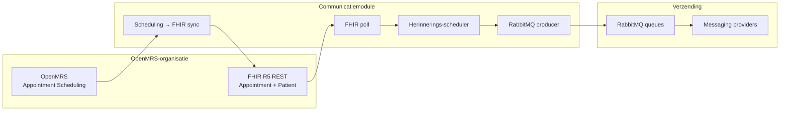

# OpenMRS Communicatiemodule

Spring Boot-applicatie die **afspraakherinneringen** uit OpenMRS ophaalt via **FHIR**, plant op basis van tijdvensters (24 uur en 1 uur voor de afspraak) en verstuurt via configureerbare **messaging-providers** (SMS/e-mail e.d.) over **RabbitMQ**.

Doelgroep van deze documentatie: **technisch beheerders** van een OpenMRS-organisatie die de koppeling tussen OpenMRS, FHIR en deze module willen inrichten en lokaal willen valideren met Docker.

| Onderdeel | Technologie |
|-----------|-------------|
| Runtime | Java 17, Spring Boot 4 |
| Database | PostgreSQL (eigen schema + optioneel dezelfde DB als OpenMRS voor scheduling-sync) |
| Wachtrij | RabbitMQ |
| Observability | OpenTelemetry, Prometheus, Grafana |

---

## Inhoud

1. [Architectuur en datastroom](#architectuur-en-datastroom)
2. [Koppeling in productie (beheerders)](#koppeling-in-productie-beheerders)
3. [Snel starten met Docker](#snel-starten-met-docker)
4. [Voorbeeldrequest (oplossing in werking)](#voorbeeldrequest-oplossing-in-werking)
5. [Poorten en onderdelen in Compose](#poorten-en-onderdelen-in-compose)
6. [Optioneel: alleen infra in Docker, app op de host](#optioneel-alleen-infra-in-docker-app-op-de-host)
7. [Build en tests](#build-en-tests)
8. [Verdere documentatie](#verdere-documentatie)

---

## Architectuur en datastroom

In de **referentie-stack** (Docker Compose) draaien naast de comm-module ook een OpenMRS-referentie, een standalone **FHIR R5**-server (HAPI) en een gesimuleerde provider (`fakecomworld`). In productie koppelt u aan **uw** OpenMRS- en FHIR-endpoints.



**Kernstappen in de keten**

1. **OpenMRS → FHIR** (optioneel, als u Appointment Scheduling in OpenMRS gebruikt): periodieke export van afspraken naar FHIR R5 (`OPENMRS_SCHEDULING_FHIR_SYNC_*`). In Docker deelt de module de Postgres-database met OpenMRS; in productie kan dit dezelfde database zijn of een aparte integratielaag — afhankelijk van uw architectuur.
2. **FHIR poll**: de module leest op interval nieuwe/gewijzigde `Appointment`-resources (`OPENMRS_FHIR_*`) en slaat ze op als `polled_appointment`.
3. **Scheduler**: afspraken in het geconfigureerde tijdvenster (24u / 1u lead) worden als bericht op de juiste provider-queue gezet.
4. **Consumer**: RabbitMQ-workers sturen via de gekozen provider; mislukte pogingen worden gelogd en opnieuw geprobeerd.

Besluitvorming over de koppeling staat in [docs/ADR-3-hoe-koppelen-we-aan-openmrs.md](docs/ADR-3-hoe-koppelen-we-aan-openmrs.md) (FHIR polling i.p.v. webhooks).

---

## Koppeling in productie (beheerders)

### Vereisten aan OpenMRS en FHIR

| Vereiste | Toelichting |
|----------|-------------|
| OpenMRS **2.7+** | Getest in de referentie-image met Legacy UI en Appointment Scheduling-module. |
| Werkende **FHIR R5 REST**-API | `Appointment` en gekoppelde `Patient` (telefoon voor SMS). De module pollt deze API; OpenMRS FHIR2 of een aparte HAPI-server is mogelijk, zolang de base-URL en auth kloppen. |
| Bereikbare netwerkverbinding | Van de comm-module naar OpenMRS (indien sync), FHIR-base-URL, RabbitMQ, Postgres en provider-API’s. |
| PostgreSQL | Eigen database voor module-tabellen (`polled_appointment`, organisatieconfig, delivery logs). |
| RabbitMQ | AMQP + management indien u queues wilt monitoren. |

### Stappenplan inrichting

1. **Database**  
   Provisioneer PostgreSQL. Zet `SPRING_DATASOURCE_URL`, `SPRING_DATASOURCE_USERNAME` en `SPRING_DATASOURCE_PASSWORD`. In productie: voeg `sslmode=require` (of strenger) toe aan de JDBC-URL.

2. **RabbitMQ**  
   Maak gebruiker/wachtwoord aan. Configureer `SPRING_RABBITMQ_HOST`, `PORT`, `USERNAME`, `PASSWORD`. Zorg dat firewallregels AMQP (5672) toestaan vanaf de module naar de broker.

3. **FHIR**  
   - `OPENMRS_FHIR_SERVER_URL` — base URL, bijv. `https://fhir.ziekenhuis.nl/fhir` (geen trailing slash-problemen: gebruik de URL die `/metadata` succesvol teruggeeft).  
   - `OPENMRS_FHIR_USERNAME` / `OPENMRS_FHIR_PASSWORD` — alleen invullen bij beveiligde server.  
   - `OPENMRS_FHIR_ORGANISATION_ID` — tenant-sleutel voor opslag; bij meerdere bronnen later per organisatie via API (zie hieronder).  
   - Optioneel: `OPENMRS_FHIR_POLL_INTERVAL_MINUTES`, `OPENMRS_FHIR_APPOINTMENT_POLL_SINCE_DAYS`, retry-instellingen (zie `.env.example`).

4. **OpenMRS scheduling-sync** (indien afspraken uit OpenMRS Legacy Scheduling komen)  
   - `OPENMRS_URL` — interne OpenMRS-base (voor test-GUI en sync).  
   - `OPENMRS_SCHEDULING_FHIR_SYNC_ENABLED=true`  
   - `OPENMRS_SCHEDULING_SYNC_ZONE` — tijdzone voor afspraaktijden (bijv. `Europe/Amsterdam`).  
   - `OPENMRS_SCHEDULING_SYNC_FALLBACK_PHONE` — alleen voor test/ontwikkeling als patiënten geen telefoonattribuut hebben.

5. **Herinneringen**  
   - `COMM_NOTIFICATION_REMINDER_LEAD_HOURS` (standaard 24)  
   - `COMM_NOTIFICATION_REMINDER_1_LEAD_HOURS` (standaard 1)  
   - `COMM_NOTIFICATION_REMINDER_WINDOW_MINUTES` — breedte van het venster rond het doelmoment  
   - `COMM_NOTIFICATION_REMINDER_ZONE` — zone voor vensterberekening  

6. **Messaging-providers**  
   Vul API-keys en credentials in voor de providers die u gebruikt (`SWIFTSEND`, `SECUREPOST`, `LEGACYLINK`, `ASYNCFLOW`). Zie `application.properties` en `.env.example` voor de exacte variabelenamen.

7. **Versleuteling**  
   `APP_ENCRYPTION_KEY` — **exact 32 tekens**, stabiel over herstarts. Wijzigen maakt bestaande versleutelde waarden onleesbaar.

8. **Organisatieconfiguratie (API)**  
   Per organisatie kunt u FHIR-URL, poll-interval en ingeschakelde providers vastleggen:

   ```http
   POST /api/organisations/config
   Content-Type: application/json
   ```

   Details van het request-body-schema: zie `OrganisationConfigRequest` in de codebase. Ophalen: `GET /api/organisations/config/{organisationId}`.

### Aandachtspunten

| Onderwerp | Aandachtspunt |
|-----------|----------------|
| **Geen secrets in Git** | Gebruik `.env` of een secret manager; `docker-compose.yml` verwijst zonder fallbacks naar omgevingsvariabelen. |
| **FHIR downtime** | Poll faalt tijdelijk; bij volgende cyclus opnieuw. Afspraken die al in de DB staan worden nog steeds volgens schema herinnerd. |
| **Module downtime** | Na herstart hervat polling en scheduler; verstreken afspraken worden overgeslagen. |
| **Niet real-time** | Koppeling is poll-gebaseerd; geschikt voor herinneringen 24u/1u van tevoren, niet voor seconden-real-time. |
| **Tijdzone** | Scheduler en vensters gebruiken UTC-instanten met configureerbare zone; controleer `COMM_NOTIFICATION_REMINDER_ZONE` en OpenMRS/FHIR-tijden. |
| **TLS** | Client-TLS 1.3 is geconfigureerd; zorg dat FHIR- en provider-endpoints geldige certificaten hebben. |
| **Encryptiesleutel** | Nooit roteren zonder migratieplan voor versleutelde velden. |
| **Test-endpoints** | `/api/notifications/test` en `/api/test/scheduling` zijn bedoeld voor ontwikkeling/demo — beperk in productie via netwerk of reverse proxy. |
| **Docker-referentie ≠ productie** | Compose start HAPI FHIR op poort 8082; productie wijst `OPENMRS_FHIR_SERVER_URL` naar uw echte FHIR-server. |

Volledige variabelenlijst: [.env.example](.env.example).

---

## Snel starten met Docker

De repository bevat een **volledige lokale stack**: PostgreSQL, RabbitMQ, FHIR R5 (HAPI + seed), OpenMRS-referentie, comm-module, fake provider, Prometheus en Grafana.

### Vereisten

- [Docker](https://docs.docker.com/get-docker/) en Docker Compose v2
- Poorten vrij: **8080** (OpenMRS), **8081** (comm-module), **8082** (FHIR), **5432**, **5672**, **15672**, **9090**, **3000**

### Stap 1 — Omgevingsvariabelen

`docker-compose.yml` leest **alleen** uit `.env` (geen defaults in Git).

```bash
cp .env.example .env
```

Pas in `.env` minimaal alle `changeme`-waarden aan. Gebruikersnamen en hostnamen in het voorbeeld sluiten aan op de servicenamen in Compose (`postgres`, `rabbitmq`, `fhir-r5`, `openmrs`).

Belangrijk voor een stabiele demo:

- `APP_ENCRYPTION_KEY` — precies **32 tekens**, niet wijzigen tussen runs tenzij u volumes wist.
- `OPENMRS_FHIR_SERVER_URL=http://fhir-r5:8080/fhir` — zoals in `.env.example` voor Docker.

### Stap 2 — Stack bouwen en starten

Eerste start kan **enkele minuten** duren (FHIR metadata, OpenMRS healthcheck).

```bash
docker compose up -d --build
```

Status controleren:

```bash
docker compose ps
```

Wacht tot `comm-module-app` **healthy** is. De comm-module start pas na `fhir-r5-seed` (FHIR `/metadata` bereikbaar).

### Stap 3 — Controleren

| Check | URL / commando |
|-------|----------------|
| Comm-module health | http://localhost:8081/actuator/health |
| OpenMRS UI | http://localhost:8080/openmrs — gebruiker `admin`, wachtwoord uit `.env` (`OMRS_ADMIN_USER_PASSWORD`) |
| FHIR R5 (host) | http://localhost:8082/fhir/metadata |
| RabbitMQ Management | http://localhost:15672 — credentials uit `.env` |
| Scheduling test-GUI | http://localhost:8081/test-scheduling.html |
| Grafana | http://localhost:3000 — `GRAFANA_ADMIN_*` uit `.env` |

### Stack stoppen

```bash
docker compose down
```

Volumes behouden data. Volledige reset (alle compose-volumes, inclusief OpenMRS-data):

```bash
docker compose down -v
```

Na wijziging aan de OpenMRS Docker-image: `docker compose build openmrs` en stack herstarten. Blijft de oude UI zichtbaar, wis volume `openmrs_data` of gebruik `down -v`.

---

## Voorbeeldrequest (oplossing in werking)

### 1. Snelle smoke test — bericht op RabbitMQ

Controleert dat de comm-module draait en een testbericht op de wachtrij zet (daarna verwerkt de consumer richting fake provider in Compose).

**Linux / macOS / Git Bash:**

```bash
curl -sS -X POST "http://localhost:8081/api/notifications/test"
```

**Windows PowerShell:**

```powershell
Invoke-RestMethod -Method Post -Uri "http://localhost:8081/api/notifications/test"
```

**Verwachte respons (HTTP 202):**

```text
Notification queued for provider: SWIFTSEND
```

Optioneel andere provider:

```bash
curl -sS -X POST "http://localhost:8081/api/notifications/test?provider=SECUREPOST"
```

Controle in RabbitMQ Management (queue `queue.swiftsend` e.d.) of in de logs van `comm-module-app`:

```bash
docker compose logs -f comm-module
```

### 2. Volledige keten — afspraakherinnering (scheduling)

Voor de end-to-end flow (OpenMRS → FHIR → poll → scheduler → delivery log) gebruikt u de test-GUI of het stappenplan:

- Browser: http://localhost:8081/test-scheduling.html  
- Uitgebreid stappenplan: [docs/docker-scheduling-test.md](docs/docker-scheduling-test.md)

Handmatige API-check (status van scheduler en vensters):

```bash
curl -sS http://localhost:8081/api/test/scheduling/status
```

---

## Poorten en onderdelen in Compose

| Service | Hostpoort | Rol |
|---------|-----------|-----|
| `openmrs` | 8080 | Referentie OpenMRS 2.7 + scheduling |
| `comm-module` | 8081 | Deze applicatie |
| `fhir-r5` | 8082 | Standalone FHIR R5 (demo; niet OpenMRS FHIR2) |
| `postgres` | 5432 | Database |
| `rabbitmq` | 5672, 15672 | AMQP + management UI |
| `fakecomworld` | 1337 | Gesimuleerde messaging-API |
| `prometheus` | 9090 | Metrics scrape |
| `grafana` | 3000 | Dashboards |
| `otel-collector` | 4317, 4318 | OTLP traces |

---

## Optioneel: alleen infra in Docker, app op de host

Alleen PostgreSQL en RabbitMQ:

```bash
docker compose up -d postgres rabbitmq
```

Start de applicatie met Maven (hostpoort **8080**). Zet minimaal datasource- en RabbitMQ-variabelen naar `localhost` (bijv. via `application-local.properties`, niet in de repo).

```powershell
.\mvnw.cmd spring-boot:run
```

```bash
./mvnw spring-boot:run
```

Voorbeeldrequest op de host:

```bash
curl -sS -X POST http://localhost:8080/api/notifications/test
```

---

## Build en tests

JAR bouwen (tests overslaan):

```bash
./mvnw clean package -DskipTests
```

```powershell
.\mvnw.cmd clean package -DskipTests
```

Unit/integration tests:

```bash
./mvnw test
```

---

## Verdere documentatie

| Document | Inhoud |
|----------|--------|
| [docs/docker-scheduling-test.md](docs/docker-scheduling-test.md) | End-to-end scheduling in Docker |
| [docs/ADR-3-hoe-koppelen-we-aan-openmrs.md](docs/ADR-3-hoe-koppelen-we-aan-openmrs.md) | FHIR polling, scenario’s bij uitval |
| [docs/ADR-1-zelfstandige-module-of-ingebouwde-module.md](docs/ADR-1-zelfstandige-module-of-ingebouwde-module.md) | Zelfstandige module vs. embedded |
| [docs/bijlage-niet-functionele-eisen.md](docs/bijlage-niet-functionele-eisen.md) | Niet-functionele eisen |

---

## Projectstructuur

```
openmrs-comm-module/
├── src/main/java/nl/openmrs/comm_module/   # Applicatiecode
├── src/main/resources/
│   ├── application.properties              # Defaults (override via env)
│   └── db/init/                            # Postgres init scripts
├── docker-compose.yml                      # Volledige lokale stack
├── docker/                                 # OpenMRS-image, FHIR-config, Grafana, OTEL
├── .env.example                            # Voorbeeld omgevingsvariabelen
├── Dockerfile                              # Comm-module container
└── docs/                                   # ADR’s en testplannen
```
