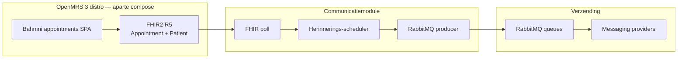

# OpenMRS Communicatiemodule

Spring Boot-applicatie die **afspraakherinneringen** uit OpenMRS ophaalt via **FHIR**, plant op basis van tijdvensters (24 uur en 1 uur voor de afspraak) en verstuurt via configureerbare **messaging-providers** (SMS/e-mail e.d.) over **RabbitMQ**.

Doelgroep van deze documentatie: **technisch beheerders** van een OpenMRS-organisatie die de koppeling tussen OpenMRS, FHIR en deze module willen inrichten en lokaal willen valideren met Docker.

| Onderdeel | Technologie |
|-----------|-------------|
| Runtime | Java 17, Spring Boot 4 |
| Database | PostgreSQL (eigen schema + optioneel dezelfde DB als OpenMRS voor scheduling-sync) |
| Wachtrij | RabbitMQ |
| Observability | OpenTelemetry, Prometheus, Grafana |

---

## Inhoud

1. [Architectuur en datastroom](#architectuur-en-datastroom)
2. [Koppeling in productie (beheerders)](#koppeling-in-productie-beheerders)
3. [Snel starten met Docker](#snel-starten-met-docker)
4. [Voorbeeldrequest (oplossing in werking)](#voorbeeldrequest-oplossing-in-werking)
5. [Poorten en onderdelen in Compose](#poorten-en-onderdelen-in-compose)
6. [Optioneel: alleen infra in Docker, app op de host](#optioneel-alleen-infra-in-docker-app-op-de-host)
7. [Build en tests](#build-en-tests)
8. [Verdere documentatie](#verdere-documentatie)

---

## Architectuur en datastroom

Lokaal draait **OpenMRS 3 Reference Application** in een **aparte** Docker-stack ([openmrs-distro-referenceapplication](https://github.com/openmrs/openmrs-distro-referenceapplication)). Deze repository start de comm-module-stack inclusief een **standalone HAPI FHIR R5**-server (`hapi-fhir-r5`, poort **8082**). Afspraken maak je in de distro-SPA; **sync** schrijft ze naar HAPI R5; **poll** leest `Appointment`/`Patient` van R5 (JDBC-fallback uit OpenMRS MariaDB blijft optioneel).



**Kernstappen in de keten**

1. **Afspraken in OpenMRS**: via de distro, bijv. http://localhost/openmrs/spa/home/appointments (Bahmni appointments).
2. **FHIR poll** (met JDBC-fallback): primair `Appointment` van `OPENMRS_FHIR_SERVER_URL`; bij FHIR-fout valt de module terug op `patient_appointment` in MariaDB.
3. **Scheduler**: afspraken in het geconfigureerde tijdvenster (24u / 1u lead) worden als bericht op de juiste provider-queue gezet.
4. **Consumer**: RabbitMQ-workers sturen via de gekozen provider; resultaat staat in `notification_delivery_log` (zichtbaar in de logmonitor-GUI).

Optioneel: **JDBC → FHIR sync** (`OPENMRS_SCHEDULING_FHIR_SYNC_ENABLED=true`) exporteert SPA-afspraken naar FHIR2 zodat FHIR-poll data kan vullen.

Besluitvorming over de koppeling staat in [docs/ADR-3-hoe-koppelen-we-aan-openmrs.md](docs/ADR-3-hoe-koppelen-we-aan-openmrs.md) (FHIR polling i.p.v. webhooks).

---

## Koppeling in productie (beheerders)

### Vereisten aan OpenMRS en FHIR

| Vereiste | Toelichting |
|----------|-------------|
| OpenMRS **3 Reference Application** | Aparte stack; SPA-afspraken in MariaDB (`patient_appointment`). OpenMRS **FHIR2 is R4** en heeft **geen** `Appointment`. |
| **FHIR R5 REST** (HAPI) | In deze compose: `http://hapi-fhir-r5:8080/fhir` met `Appointment` + `Patient` (US-003). |
| Bereikbare netwerkverbinding | Van de comm-module naar OpenMRS (indien sync), FHIR-base-URL, RabbitMQ, Postgres en provider-API’s. |
| PostgreSQL | Eigen database voor module-tabellen (`polled_appointment`, organisatieconfig, delivery logs). |
| RabbitMQ | AMQP + management indien u queues wilt monitoren. |

### Stappenplan inrichting

1. **Database**  
   Provisioneer PostgreSQL. Zet `SPRING_DATASOURCE_URL`, `SPRING_DATASOURCE_USERNAME` en `SPRING_DATASOURCE_PASSWORD`. In productie: voeg `sslmode=require` (of strenger) toe aan de JDBC-URL.

2. **RabbitMQ**  
   Maak gebruiker/wachtwoord aan. Configureer `SPRING_RABBITMQ_HOST`, `PORT`, `USERNAME`, `PASSWORD`. Zorg dat firewallregels AMQP (5672) toestaan vanaf de module naar de broker.

3. **FHIR**  
   - `OPENMRS_FHIR_SERVER_URL` — base URL, bijv. `https://fhir.ziekenhuis.nl/fhir` (geen trailing slash-problemen: gebruik de URL die `/metadata` succesvol teruggeeft).  
   - `OPENMRS_FHIR_USERNAME` / `OPENMRS_FHIR_PASSWORD` — alleen invullen bij beveiligde server.  
   - `OPENMRS_FHIR_ORGANISATION_ID` — tenant-sleutel voor opslag; bij meerdere bronnen later per organisatie via API (zie hieronder).  
   - Optioneel: `OPENMRS_FHIR_POLL_INTERVAL_MINUTES`, `OPENMRS_FHIR_APPOINTMENT_POLL_SINCE_DAYS`, retry-instellingen (zie `.env.example`).

4. **OpenMRS scheduling-sync** (alleen Legacy Scheduling + gedeelde Postgres, niet voor de distro)  
   - `OPENMRS_SCHEDULING_FHIR_SYNC_ENABLED=false` bij FHIR-poll op de distro.  
   - `OPENMRS_SCHEDULING_SYNC_ZONE` — tijdzone bij JDBC-export.  
   - `OPENMRS_SCHEDULING_SYNC_FALLBACK_PHONE` — alleen voor test als patiënten geen telefoonattribuut hebben.

5. **Herinneringen**  
   - `COMM_NOTIFICATION_REMINDER_LEAD_HOURS` (standaard 24)  
   - `COMM_NOTIFICATION_REMINDER_1_LEAD_HOURS` (standaard 1)  
   - `COMM_NOTIFICATION_REMINDER_WINDOW_MINUTES` — breedte van het venster rond het doelmoment  
   - `COMM_NOTIFICATION_REMINDER_ZONE` — zone voor vensterberekening  

6. **Messaging-providers**  
   Vul API-keys en credentials in voor de providers die u gebruikt (`SWIFTSEND`, `SECUREPOST`, `LEGACYLINK`, `ASYNCFLOW`). Zie `application.properties` en `.env.example` voor de exacte variabelenamen.

7. **Versleuteling**  
   `APP_ENCRYPTION_KEY` — **exact 32 tekens**, stabiel over herstarts. Wijzigen maakt bestaande versleutelde waarden onleesbaar.

8. **Organisatieconfiguratie (API)**  
   Per organisatie kunt u FHIR-URL, poll-interval en ingeschakelde providers vastleggen:

   ```http
   POST /api/organisations/config
   Content-Type: application/json
   ```

   Details van het request-body-schema: zie `OrganisationConfigRequest` in de codebase. Ophalen: `GET /api/organisations/config/{organisationId}`.

### Aandachtspunten

| Onderwerp | Aandachtspunt |
|-----------|----------------|
| **Geen secrets in Git** | Gebruik `.env` of een secret manager; `docker-compose.yml` verwijst zonder fallbacks naar omgevingsvariabelen. |
| **FHIR downtime** | Poll faalt tijdelijk; bij volgende cyclus opnieuw. Afspraken die al in de DB staan worden nog steeds volgens schema herinnerd. |
| **Module downtime** | Na herstart hervat polling en scheduler; verstreken afspraken worden overgeslagen. |
| **Niet real-time** | Koppeling is poll-gebaseerd; geschikt voor herinneringen 24u/1u van tevoren, niet voor seconden-real-time. |
| **Tijdzone** | Scheduler en vensters gebruiken UTC-instanten met configureerbare zone; controleer `COMM_NOTIFICATION_REMINDER_ZONE` en OpenMRS/FHIR-tijden. |
| **TLS** | Client-TLS 1.3 is geconfigureerd; zorg dat FHIR- en provider-endpoints geldige certificaten hebben. |
| **Encryptiesleutel** | Nooit roteren zonder migratieplan voor versleutelde velden. |
| **Test-endpoints** | `/api/notifications/test` en `/api/test/scheduling` zijn bedoeld voor ontwikkeling/demo — beperk in productie via netwerk of reverse proxy. |
| **Docker-referentie ≠ productie** | Lokaal: distro op poort 80, comm-module op 8081; `OPENMRS_FHIR_SERVER_URL` wijst naar FHIR2 R5 van uw OpenMRS. |

Volledige variabelenlijst: [.env.example](.env.example).

---

## Snel starten met Docker

Twee stacks: eerst de **OpenMRS 3 distro**, daarna deze **comm-module**.

### Vereisten

- [Docker](https://docs.docker.com/get-docker/) en Docker Compose v2
- Poorten vrij: **80** (distro gateway), **8081** (comm-module), **5432**, **5672**, **15672**, **9090**, **3000**

### Stap 0 — OpenMRS Reference Application (aparte map)

```bash
git clone https://github.com/openmrs/openmrs-distro-referenceapplication.git
cd openmrs-distro-referenceapplication
docker compose up -d
```

Wacht tot gateway/backend klaar zijn. UI: http://localhost/openmrs/spa — afspraken: http://localhost/openmrs/spa/home/appointments (standaard login `admin` / `Admin123`).

Controleer FHIR2 R5 vanaf de host:

```bash
curl -sS http://localhost:8082/fhir/metadata
```

### Stap 1 — Omgevingsvariabelen (comm-module)

`docker-compose.yml` leest **alleen** uit `.env` (geen defaults in Git).

```bash
cp .env.example .env
```

Pas minimaal alle `changeme`-waarden aan. Belangrijk:

- `APP_ENCRYPTION_KEY` — precies **32 tekens**, stabiel tussen runs.
- `OPENMRS_FHIR_SERVER_URL=http://hapi-fhir-r5:8080/fhir` — HAPI R5 in dezelfde compose (host: poort **8082**).
- `OPENMRS_FHIR_USERNAME` / `OPENMRS_FHIR_PASSWORD` — distro-credentials (standaard `admin` / `Admin123`).
- `OPENMRS_FHIR_POLL_MODE=fhir` en `OPENMRS_FHIR_JDBC_FALLBACK_ENABLED=true` — FHIR primair, JDBC bij fout.
- `OPENMRS_DATASOURCE_URL` — MariaDB voor JDBC-fallback (reference distro poort 3307).
- `OPENMRS_SCHEDULING_FHIR_SYNC_ENABLED=true` — optioneel SPA → FHIR2 exporteren.

### Stap 2 — Comm-module-stack starten

```bash
docker compose up -d --build
```

```bash
docker compose ps
```

Wacht tot `comm-module-app` **healthy** is.

### Stap 3 — Controleren

| Check | URL / commando |
|-------|----------------|
| Comm-module health | http://localhost:8081/actuator/health |
| OpenMRS distro SPA | http://localhost/openmrs/spa |
| Afspraken (Bahmni) | http://localhost/openmrs/spa/home/appointments |
| FHIR2 R5 metadata | `curl -u admin:Admin123 http://localhost/openmrs/ws/fhir2/R5/metadata` |
| Logmonitor (poll + delivery log) | http://localhost:8081/test-scheduling.html |
| RabbitMQ Management | http://localhost:15672 — credentials uit `.env` |
| Grafana | http://localhost:3000 — `GRAFANA_ADMIN_*` uit `.env` |

### Stap 4 — End-to-end test

1. Maak in de distro een afspraak voor een patiënt **met telefoonnummer**.
2. Open de logmonitor; klik **FHIR poll nu** (of wacht op interval).
3. Controleer **Polled appointments** en later **Delivery log** (scheduler + fake provider).

Zie [docs/docker-scheduling-test.md](docs/docker-scheduling-test.md) voor venster-instellingen (24u / 1u).

### Stack stoppen

```bash
docker compose down
```

Volumes behouden comm-module-data. Volledige reset: `docker compose down -v`.

---

## Voorbeeldrequest (oplossing in werking)

### 1. Snelle smoke test — bericht op RabbitMQ

Controleert dat de comm-module draait en een testbericht op de wachtrij zet (daarna verwerkt de consumer richting fake provider in Compose).

**Linux / macOS / Git Bash:**

```bash
curl -sS -X POST "http://localhost:8081/api/notifications/test"
```

**Windows PowerShell:**

```powershell
Invoke-RestMethod -Method Post -Uri "http://localhost:8081/api/notifications/test"
```

**Verwachte respons (HTTP 202):**

```text
Notification queued for provider: SWIFTSEND
```

Optioneel andere provider:

```bash
curl -sS -X POST "http://localhost:8081/api/notifications/test?provider=SECUREPOST"
```

Controle in RabbitMQ Management (queue `queue.swiftsend` e.d.) of in de logs van `comm-module-app`:

```bash
docker compose logs -f comm-module
```

### 2. Volledige keten — afspraakherinnering (scheduling)

Voor de end-to-end flow (distro-afspraak → FHIR poll → scheduler → delivery log) gebruikt u de logmonitor of het stappenplan:

- Browser: http://localhost:8081/test-scheduling.html (alleen poll-status en delivery logs)  
- Uitgebreid stappenplan: [docs/docker-scheduling-test.md](docs/docker-scheduling-test.md)

Handmatige API-check (status van scheduler en vensters):

```bash
curl -sS http://localhost:8081/api/test/scheduling/status
```

---

## Poorten en onderdelen in Compose

| Service | Hostpoort | Rol |
|---------|-----------|-----|
| *(extern)* distro gateway | 80 | OpenMRS 3 + Bahmni appointments (aparte compose) |
| `comm-module` | 8081 | Deze applicatie |
| `postgres` | 5432 | Database comm-module |
| `rabbitmq` | 5672, 15672 | AMQP + management UI |
| `fakecomworld` | 1337 | Gesimuleerde messaging-API |
| `prometheus` | 9090 | Metrics scrape |
| `grafana` | 3000 | Dashboards |
| `otel-collector` | 4317, 4318 | OTLP traces |

---

## Optioneel: alleen infra in Docker, app op de host

Alleen PostgreSQL en RabbitMQ:

```bash
docker compose up -d postgres rabbitmq
```

Start de applicatie met Maven (hostpoort **8080**). Zet minimaal datasource- en RabbitMQ-variabelen naar `localhost` (bijv. via `application-local.properties`, niet in de repo).

```powershell
.\mvnw.cmd spring-boot:run
```

```bash
./mvnw spring-boot:run
```

Voorbeeldrequest op de host:

```bash
curl -sS -X POST http://localhost:8080/api/notifications/test
```

---

## Build en tests

JAR bouwen (tests overslaan):

```bash
./mvnw clean package -DskipTests
```

```powershell
.\mvnw.cmd clean package -DskipTests
```

Unit/integration tests:

```bash
./mvnw test
```

Rapportage (Sprint 3): [TESTRAPPORTAGE.md](TESTRAPPORTAGE.md) (106 tests, kernlogica) en [PERFORMANCERAPPORTAGE.md](PERFORMANCERAPPORTAGE.md) (throughput/latency in Docker).

---

## Verdere documentatie

| Document | Inhoud |
|----------|--------|
| [TESTRAPPORTAGE.md](TESTRAPPORTAGE.md) | Unit- en integratietests (scheduler, providers, idempotentie) |
| [PERFORMANCERAPPORTAGE.md](PERFORMANCERAPPORTAGE.md) | Throughput, latency en betrouwbaarheid onder belasting |
| [docs/docker-scheduling-test.md](docs/docker-scheduling-test.md) | End-to-end scheduling in Docker |
| [docs/ADR-3-hoe-koppelen-we-aan-openmrs.md](docs/ADR-3-hoe-koppelen-we-aan-openmrs.md) | FHIR polling, scenario’s bij uitval |
| [docs/ADR-1-zelfstandige-module-of-ingebouwde-module.md](docs/ADR-1-zelfstandige-module-of-ingebouwde-module.md) | Zelfstandige module vs. embedded |
| [docs/bijlage-niet-functionele-eisen.md](docs/bijlage-niet-functionele-eisen.md) | Niet-functionele eisen |

---

## Projectstructuur

```
openmrs-comm-module/
├── src/main/java/nl/openmrs/comm_module/   # Applicatiecode
├── src/main/resources/
│   ├── application.properties              # Defaults (override via env)
│   └── db/init/                            # Postgres init scripts
├── docker-compose.yml                      # Volledige lokale stack
├── docker/                                 # Grafana, OTEL; oude OpenMRS-image (niet in compose)
├── .env.example                            # Voorbeeld omgevingsvariabelen
├── Dockerfile                              # Comm-module container
└── docs/                                   # ADR’s en testplannen
```
